# Medicare Patient Outcomes: Reducing Readmissions & Optimizing Costs

## 1. Project Background
### The Readmission Challenge
Hospital readmissions remain a persistent challenge within the U.S. healthcare system, contributing to billions of dollars in additional healthcare spending each year. A readmission—defined as a patient being admitted to a hospital within 30 days of a previous discharge—often signals gaps in care quality, discharge planning, or patient follow-up. To curb avoidable readmissions and incentivize better outcomes, the Centers for Medicare & Medicaid Services (CMS) introduced the Hospital Readmissions Reduction Program (HRRP), which imposes financial penalties on hospitals with higher-than-expected readmission rates for certain conditions.

### CMS Policy Context: The HRRP
This policy shift has heightened the need for hospitals to not only monitor their readmission metrics but also understand the associated financial implications. Hospitals face growing pressure to improve patient outcomes while maintaining cost-efficiency—particularly as Medicare reimbursement models evolve toward value-based care.

### Cost Variation Across Hospitals
Simultaneously, significant variation exists in Medicare inpatient costs across hospitals, driven by factors such as geographic location, patient demographics, facility ownership type, and clinical practice styles. Understanding how these cost patterns intersect with readmission performance is essential for both hospital administrators and policymakers.

### Project Data & Focus Areas
This project addresses these intersecting challenges by analyzing national data on readmission rates and Medicare inpatient costs. By leveraging data from both the HRRP readmissions dataset and the Medicare Inpatient Charges dataset, this analysis seeks to uncover patterns, outliers and correlations that can inform evidence-based decision-making. The focus spans multiple clinical conditions, including heart failure, pneumonia, COPD, heart attack (AMI), hip/knee replacement (THA/TKA) and coronary artery bypass graft (CABG) surgery—conditions most commonly evaluated under CMS penalties.

### Purpose & Stakeholder Value
The ultimate goal is to generate actionable insights that help hospitals reduce readmission penalties, improve patient care quality, support more efficient Medicare spending and enable smarter healthcare policies.

## 2. Executive Summary
- This report examines the average Medicare payments, readmission rates, and associated healthcare outcomes across various rural-urban continuum areas (RUCA) and discharges, offering actionable insights for hospital executives, policy makers, insurers, quality teams, and data analysts. 
- It delves into strategies for optimizing resource allocation, improving cost-efficiency, reducing readmission rates and leveraging data for better healthcare delivery. The key findings and recommendations are summarized below:

#### Medicare Payments by RUCA
- Hospital executives, especially in rural areas with lower Medicare payments, are encouraged to optimize resource allocation by integrating telemedicine and focusing on cost-effective care models. 
- In urban centers with higher payments, streamlining processes through data-driven management and predictive analytics can help reduce costs without compromising care quality. 
- CMS and policymakers should incentivize telehealth expansion in rural settings and support value-based care in urban hospitals to reduce service volume dependency and improve patient outcomes.

#### Excess Readmission Ratio (ERR) and Medicare Payments
- Addressing ERR through targeted quality improvement programs can minimize readmissions in both high- and low-payment regions. 
- For rural areas, where payments are often lower, strategies focusing on preventive care and chronic disease management can mitigate readmission risks. Urban hospitals should adopt practices that ensure evidence-based care pathways are followed to reduce readmissions. 
- CMS should refine reimbursement models and encourage national collaboration to share best practices for reducing readmissions.

#### Excess Readmission Ratio by Number of Discharges
- Hospitals with high outlier status for readmissions should prioritize targeted interventions, particularly for low-volume programs that may disproportionately be penalized. 
- Analyzing the common causes of high readmissions across facilities can help streamline care processes and reduce penalties. 
- Insurers and CMS should focus on value-driven healthcare models to reduce readmission outliers, while healthcare consultants can provide detailed insights into the root causes of readmission outliers and inform improvement strategies.

#### State-Level Matching of Facilities
- State-level data discrepancies may impact the accurate benchmarking of hospital performance. Hospital executives are urged to focus on integrating internal data for a more holistic view of hospital performance, while CMS and policymakers must address data gaps at the state level to ensure effective decision-making. 
- Data analysts should document these limitations clearly and suggest improvements to enhance data integration.

## 3. Dataset Overview
This project integrates two publicly available Medicare datasets (see 3.1. and 3.2. below) to explore the relationship between hospital readmission rates and inpatient costs. Together, these datasets offer a comprehensive view of healthcare quality and cost efficiency across U.S. hospitals, with a specific focus on conditions targeted by the Hospital Readmissions Reduction Program (HRRP).

### 3.1. Hospital Readmissions Reduction Program (HRRP) Data (2022–2023)
This dataset from the Centers for Medicare & Medicaid Services (CMS) contains performance data on hospital readmissions. It provides excess readmission ratios for six high-impact clinical conditions used to determine financial penalties under the HRRP.

#### Cleaned and Standardized Fields Used in Analysis:

- ```Facility Name```, ```Facility ID```, ```State```

- ```Condition``` – standardized from CMS ```Measure Name``` (e.g., “READM-30-AMI-HRRP” → “Heart Attack (AMI)”)

- ```Number of Discharges```, ```Number of Readmissions```

- ```Excess Readmissions Ratio```, ```Expected Readmission Rate```, ```Predicted Readmission Rate```

- ```Readmission Outlier Status``` – derived using IQR and Z-score methods by condition

#### Key Transformation Highlights:
- Mapped complex CMS measure names to standardized clinical condition names
- Generated outlier flags to identify facilities performing above or below expected norms

### 3.2. Medicare Inpatient Hospital Charges Data (2022)
This dataset includes financial data for Medicare-covered inpatient services, detailing average billed amounts and Medicare payments by hospital and procedure type.

#### Cleaned and Standardized Fields Used in Analysis:

- ```Facility ID```, ```Facility Name```, ```State```, ```City```, ```Zip Code```

- ```Condition``` – mapped from ```DRG Code``` and ```DRG Description```

- ```Average Covered Charges```, ```Average Total Payments```, ```Average Medicare Payments```

- ```RUCA Short Description``` – mapped from ```RUCA Code```

- ```Cost Outlier Status``` – Z-score-based outlier flags for each cost metric

#### Key Transformation Highlights:
- Mapped DRG Codes to aligned clinical conditions for cross-dataset consistency
- Translated numeric RUCA Codes into descriptive rural-urban classifications
- Flagged outlier facilities based on cost distribution by condition

### 3.3. Data Integration Approach
The two datasets were joined on ```Facility ID``` and a unified ```Condition``` field. Key integration steps included:

- Mapping ```Measure Name``` → ```Condition``` in the readmissions dataset
- Mapping ```DRG Code``` → ```Condition``` in the costs dataset
- Mapping ```RUCA Code``` → ```RUCA Short Description``` for geographic analysis

Facilities with missing, unmatched, or incomplete data were excluded to preserve accuracy.

## 4. Insights Deep-Dive
- In order to provide clear, actionable insights across different stakeholder perspectives, the final analysis is divided into three primary Tableau dashboards: **Readmissions**, **Costs** and **Facilities**. 
- Each dashboard includes a set of consistent key performance indicators (KPIs) at the top — displayed as BANs — such as **average excess readmission ratio**, **total number of facilities** (from both readmissions and cost datasets), **number of matching facilities** across both datasets, **average Medicare payments** and **total Medicare payments**. 
- These BANs offer immediate context for comparisons and performance benchmarking.

## 4.1. Readmissions Dashboard
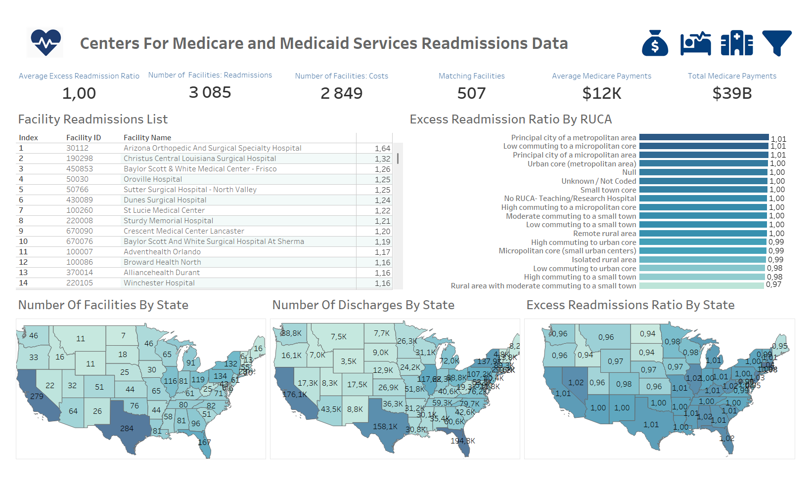
- This dashboard focuses on analyzing geographic and urban-rural patterns in hospital readmissions. It includes:

    - **Facility Readmission Table**: Lists facility IDs and names with their average excess readmission ratios, allowing filtering and direct lookup of underperforming or penalized facilities.

    - **Excess Readmissions Rate by RUCA**: A horizontal bar chart breaking down average excess readmission ratios by urban-rural classification (RUCA short description).

    - **Geographic Heat Maps**:

        - **Number of Facilities by State**: Visualizes how many hospitals per state are captured in the readmissions dataset.

        - **Number of Discharges by State**: Shows patient discharge volumes per state.

        - **Average Excess Readmission Ratio by State**: Highlights which states are exceeding or staying below the CMS benchmark ratio. A global filter allows all charts to be segmented by medical condition (e.g., Heart Failure, COPD, etc.), revealing how outcomes vary across clinical categories and geographic areas.

### 4.1.1 Facility Readmission List 
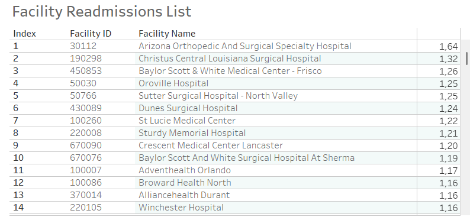
#### General Insights:
**Facility Distribution**: Out of 3085 facilities, 2862 provide data on excess readmission ratios, showcasing a significant amount of actionable data. The remaining facilities likely have incomplete or unavailable data.

#### High Excess Readmission Ratios:

- **Top Performers**: Facilities such as Arizona Spine And Joint Hospital (0.66), New England Baptist Hospital (0.66), and Orthoindy Hospital (0.65) show excellent performance with ratios below 0.8, indicating fewer readmissions than expected.

- **Worst Performers**: Hospitals like Arizona Orthopedic And Surgery Speciality Hospital (1.6), Christus Central Louisiana Surgical Hospital (1.3), and Baylor Scott & White Medical Centre - Frisco (1.26) are underperforming, with excess readmission ratios above 1.2, signaling a need for intervention and improvement in care management to reduce avoidable readmissions.

- **Performance Grouping**: About 1400 facilities have excess readmission ratios above 1.0, which represents a critical focus area for improvement. Conversely, 1443 facilities have ratios at or below 1.0, suggesting better-than-expected patient outcomes, but there’s still room for optimization.

### Condition-Specific Insights:
#### CABG:

- **Worst Performers**: Facilities like Robert Wood Johnson University Hospital (1.35) and Tacoma General Allenmore Hospital (1.33) are flagged as high outliers.

- **Best Performers**: Sarasota Memorial Hospital (0.79) and Christus Mother Frances Hospital (0.74) have the best ratios, underlining the effectiveness of certain medical protocols or patient care strategies.

#### COPD:

- **Worst Performers**: Oroville Hospital (1.28) and Tennoca Healthcare-Clarksville (1.25) exhibit high readmission ratios.

- **Best Performers**: Holmes Regional Medical Center (0.81) is a standout with significantly lower excess readmission ratios, highlighting an opportunity to investigate the strategies employed at these top facilities.

#### Heart Attack (AMI):

- **Worst Performers**: Hospitals such as Mercy St Vincent Medical Center (1.28) and St Lucie Medical Center (1.25) need attention.

- **Best Performers**: Intermountain Medical Center (0.79) and Mayo Clinic Hospital Rochester (0.79) are performing well with the best ratios under 0.8.

#### Heart Failure (HF):

- **Worst Performers**: Oroville Hospital (1.31) and UCLA West Valley Medical Center (1.28) are significant outliers with high readmission ratios.

- **Best Performers**: Northern Light Eastern Maine Medical Center (0.79) and Intermountain Medical Center (0.79) are examples of facilities with the lowest excess readmission ratios.

#### Hip/Knee Replacement (THA/TKA):

- **Worst Performers**: Arizona Orthopedic And Surgical Speciality Hospital (1.64) and Louis A Weiss Memorial Hospital (1.56) have excessively high readmission ratios, signaling possible issues in post-surgery care and follow-up.

- **Best Performers**: Stanford Health Care (0.64) and Arkansas Surgical Hospital (0.64) are among the top performers.

#### Pneumonia:

- **Worst Performers**: Oroville Hospital (1.49) and St John’s Episcopal Hospital (1.29) have notably high excess readmission ratios.

- **Best Performers**: Holmes Regional Medical Center (0.78) and Kootenai Health (0.78) exhibit low readmission ratios, suggesting successful care protocols.

### Comparing Conditions
#### High Outliers – Facilities with Consistently High Ratios
- **Oroville Hospital** appears multiple times as a top outlier, with high excess readmission ratios across:

    - COPD (1.28) – highest for the condition

    - Heart Failure (1.31) – highest for the condition

    - Pneumonia (1.49) – highest overall in pneumonia

- **St Lucie Medical Center** also shows consistently poor performance:

    - Heart Attack (1.25)

    - Heart Failure (1.27)

- These facilities may have systemic issues such as inadequate discharge planning, lack of follow-up care, or high-risk patient populations.

#### Top Performers – Consistently Low Ratios
- A number of facilities show exceptional performance across multiple conditions:

    - **Arkansas Surgical Hospital**, **Kansas City Orthopaedic Institute**, and **Kansas Surgery & Recovery Center** perform especially well for THA/TKA, with ratios below 0.65.

    - **Intermountain Medical Center** and **Northern Light Eastern Maine Medical Center** demonstrate top results in Heart Attack and Heart Failure, both under 0.80.

- These facilities might benefit from being analyzed further to extract best practices, particularly in post-op care, patient education, and care coordination.

#### Facility Count Breakdown
- Heart Failure (HF) has the most facilities with reported ratios (2638), followed closely by Pneumonia (2731) and COPD (2324).

- CABG (883) and THA/TKA (1583) have fewer facilities reporting, likely due to being more specialized procedures.

- This disparity in volume suggests that conditions like Pneumonia and Heart Failure might offer the best opportunities for systemic readmission reduction strategies due to their scale and frequency.

####  Observed Patterns by Condition
- Surgical Procedures (CABG, THA/TKA) tend to show more variance across facilities, likely due to differences in surgical protocols, post-op care, and follow-up procedures.

- Chronic/Acute Conditions (COPD, Heart Failure, Pneumonia) have broader coverage but a more centered distribution of ratios, suggesting more standard care paths but also the impact of population health and community-level factors.

- Cardiac conditions (Heart Attack & Heart Failure) frequently appear in both best and worst performer lists, reflecting how sensitive these metrics are to discharge planning, medication management, and coordinated care.
### 4.1.2.  Excess Readmission Ratio By RUCA 
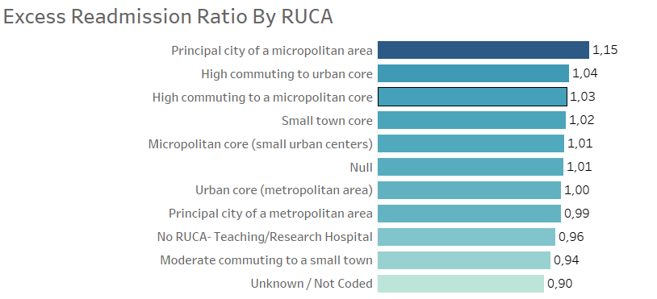
<BR>*Global Condition Filter: CABG*
### General Insights:
#### Readmission Ratios Across RUCA Types:

<u>RUCA Areas with Ratios Above 1:</u>

- RUCA areas like Principal city of a metropolitan area and Low commuting to a micropolitan core have excess readmission ratios slightly above 1.0 (e.g., 1.01), suggesting these locations may have relatively higher readmission rates.

- Some areas with higher readmission ratios also include those that deal with unique demographic or geographic challenges, such as Remote rural areas and Isolated rural areas, which tend to have ratios above 1 in several conditions.

<u>RUCA Areas with Ratios Equal to 1:</u> 

- Areas like Urban core (metropolitan area) and Micropolitan core (small urban centers) show ratios of exactly 1.0, indicating average levels of excess readmissions for those regions.

<u>RUCA Areas with Ratios Below 1:</u> 
- Certain rural and urban areas, such as High commuting to urban core and Micropolitan core, have ratios below 1.0 (e.g., 0.97, 0.99), signaling lower-than-expected readmissions, potentially due to more efficient healthcare delivery systems or fewer risk factors for patients in those regions.

### Condition-Specific Insights:
#### CABG (Coronary Artery Bypass Graft Surgery):

- **RUCA with Ratios Above 1**: Principal city of a micropolitan area (1.15) and High commuting to urban core (1.04) are seeing slightly higher-than-average readmission rates, which may indicate challenges specific to those regions in managing CABG readmissions.

- **RUCA with Ratios Below 1**: Urban core (metropolitan area) (1.0) and No RUCA (teaching/research hospital) (0.96) are performing well with lower-than-average readmission ratios, suggesting that specialized care in these areas might be contributing to lower excess readmissions.

#### COPD (Chronic Obstructive Pulmonary Disease):

- **RUCA with Ratios Above 1**: Areas like High commuting to a small town (1.01) and Remote rural areas (1.01) exhibit slightly higher readmission ratios, likely influenced by limited access to care or higher rates of smoking and comorbidities in these areas.

- **RUCA with Ratios Below 1**: High commuting to a micropolitan core (0.99) and Rural areas with moderate commuting to a small town (0.98) show lower-than-expected readmissions, which could be linked to community-based interventions and better access to respiratory care.

#### Heart Attack (AMI):

- **RUCA with Ratios Above 1**: High commuting to a small town (1.05) and Principal city of a micropolitan area (1.03) have elevated readmission ratios, possibly due to a higher prevalence of chronic heart conditions or delayed access to specialized cardiac care.

- **RUCA with Ratios Below 1**: Micropolitan core (0.99) and Rural areas with moderate commuting to a small town (0.98) display lower-than-expected readmission rates, suggesting successful heart attack management or better post-discharge support systems.

#### Heart Failure (HF):

- **RUCA with Ratios Above 1**: Isolated rural areas (1.05) and No RUCA (teaching/research hospital) (1.05) show higher-than-average readmission ratios, which could reflect issues such as limited access to follow-up care and resources in rural areas.

- **RUCA with Ratios Below 1**: High commuting to a small town (0.99) and Rural areas with moderate commuting to a small town (0.97) perform better than average, likely due to community-driven health initiatives and strong local healthcare infrastructure.

#### Hip/Knee Replacement (THA/TKA):

- **RUCA with Ratios Above 1**: Principal city of a micropolitan area (1.05) and Principal city of a metropolitan area (1.04) exhibit higher readmission ratios, potentially related to complications post-surgery or longer recovery periods in these regions.

- **RUCA with Ratios Below 1**: Micropolitan core (small urban centers) (0.99) and No RUCA (teaching/research hospital) (0.97) show lower-than-average readmissions, possibly reflecting specialized care or effective post-surgical rehabilitation.

#### Pneumonia:

- **RUCA with Ratios Above 1**: Moderate commuting to a small town (1.03) and Urban core (metropolitan area) (1.01) have slightly higher readmission rates, possibly due to the complex nature of pneumonia and its interaction with comorbid conditions.

- **RUCA with Ratios Below 1**: Remote rural area (0.99) and Micropolitan core (small urban centers) (0.99) show better performance, indicating that rural and small urban centers may have lower-than-expected readmission rates.

### 4.1.3. Number of Facilities by State 
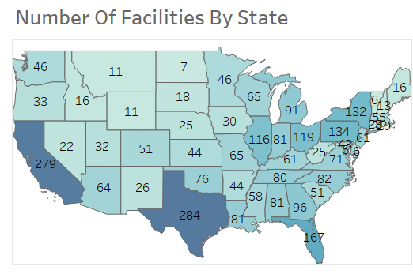
#### National Distribution Patterns
- The map reveals a wide distribution of hospital facilities across the United States. Texas (284) and California (279) have the highest number of facilities, followed by Florida (167), Pennsylvania (134), New York (132), Ohio (119), and Illinois (116)—all states represented in the darkest hues of blue due to their concentration of hospitals. 
- These states serve as key regions for analyzing readmission impacts and implementing interventions.

#### Medium-Tier States
- States with a moderate number of facilities include Georgia (96), Michigan (91), North Carolina (82), Alabama (81), Indiana (81), Tennessee (80), Oklahoma (76), and Virginia (71). 
- These states represent stable healthcare infrastructure, making them suitable candidates for comparative benchmarking.

#### Low-Facility States
- At the other end of the spectrum, states with relatively few reporting facilities include District of Columbia (6), Vermont (6), Delaware (6), North Dakota (7), Alaska (8), Rhode Island (10), Montana (11), Wyoming (11), Hawaii (12), and New Hampshire (13). 
- These regions may face limitations in specialized care availability and could benefit from telehealth expansion and federal support initiatives.

### 4.1.4. Number of Discharges by State
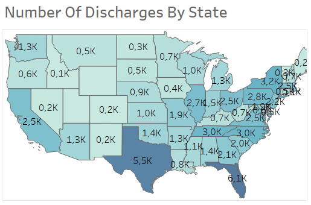
<BR>*Global Condition Filter: CABG*

#### High Burden of Chronic Conditions in the South

- States like **Florida** (194.3k), **Texas** (158.1k), **Ohio** (88.8k), and **Georgia** (60.6k) show high discharge volumes for Heart Failure, COPD, and Pneumonia, indicating a heavy burden of chronic conditions in these regions.

#### Underutilization of Surgical Procedures in Some States

- States like **Utah** (8.3k), **Vermont** (4.8k), and **Wyoming** (3.5k) have "NULL" or low discharge volumes for CABG and Hip/Knee replacements, suggesting potential barriers to access or underreporting.

#### High Discharge Volumes for Pneumonia and Heart Failure

- **California** (61.7k for Pneumonia, 65.4k for Heart Failure), **Florida** (66.0k for Pneumonia, 67.9k for Heart Failure), and **Texas** (54.0k for Pneumonia, 56.9k for Heart Failure) are leading states for Pneumonia and Heart Failure discharges, pointing to these conditions being major drivers of inpatient admissions.

#### COPD and Heart Disease Prevalence Suggest Policy Priorities

- Southern and Appalachian states, such as **Kentucky** (40.6k for Heart Failure, 5.1k for COPD), **West Virginia** (19.3k for Heart Failure, 2.7k for COPD), and **Alabama** (35.4k for discharges, 3.6k for COPD), exhibit high COPD and heart disease discharges, indicating the need for targeted health initiatives.

#### Disparities in Surgery Access

- There are significant variations in CABG and Hip/Knee replacement volumes across states. For example, California (2.5k for CABG, 12.7k for THA/TKA) is performing much higher numbers of surgeries compared to Utah (NULL for CABG, 0.4k for THA/TKA) and Vermont (NULL for CABG, NULL for THA/TKA), which may be due to access disparities or differences in healthcare infrastructure.

### 4.1.5. Average Excess Readmissions Ratio (ERR) by State
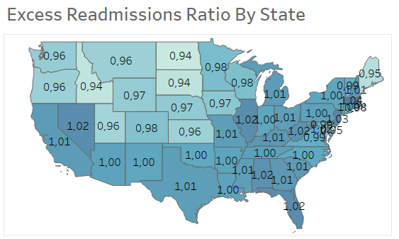
#### All Conditions
- The Excess Readmission Ratios (ERR) for various states range from 0.94 (Idaho, North Dakota, South Dakota) to 1.04 (Massachusetts), with most states clustering around the ratio of 1. 
- This indicates variability in readmission performance across states, with some states experiencing slightly higher or lower than expected readmissions.

## 4.2. Costs Dashboard
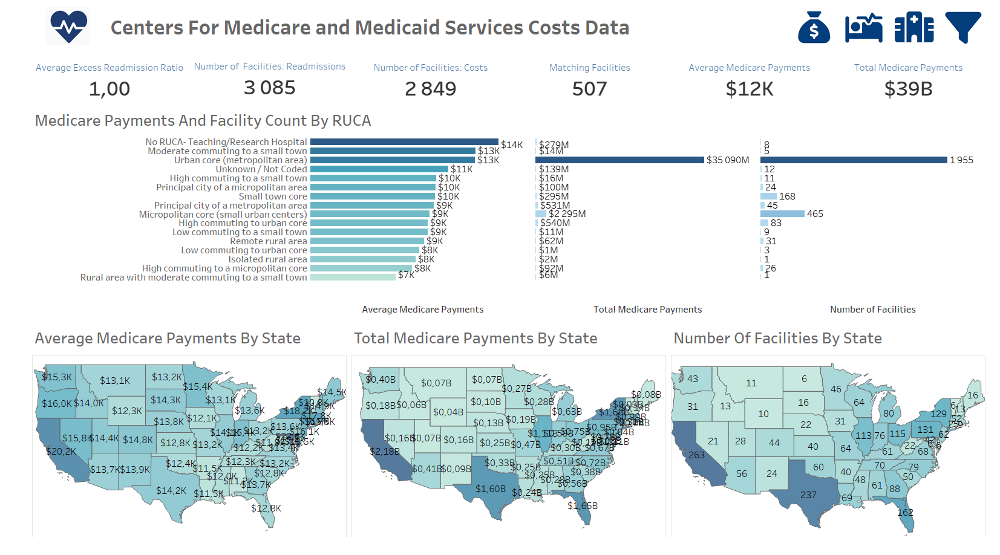
- This dashboard evaluates the distribution and concentration of healthcare costs across regions and urbanization levels:

    - **Bar Charts by RUCA Description**:

        - **Average Medicare Payments**

        - **Total Medicare Payments**

        - **Number of Facilities**:  These are plotted along the same RUCA axis to compare utilization and cost burdens by urban vs. rural hospital locations.

    - **Geographic Heat Maps**:

        - **Average Medicare Payments by State**

        - **Total Medicare Payments by State**

        - **Number of Facilities by State** 
            : (based on distinct facility IDs from the costs dataset) Together, these views provide critical insights into where healthcare costs are highest, both in per-treatment and cumulative terms and whether rural or urban settings are more cost-intensive.

### 4.2.1. Average Medicare Payments by State
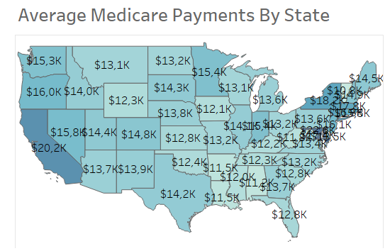
#### Higher Average Medicare Payments:
- **California (CA)**: With an average of **$20.2k**, California stands out as having the highest overall average Medicare payment, suggesting that medical facilities in this state may have more expensive procedures or a higher rate of Medicare reimbursement.
- **New York (NY)**: At **$18.2k**, New York also demonstrates high Medicare spending, possibly due to more expensive health services or a larger elderly population requiring treatment.

#### Lower Average Medicare Payments:
- **Alabama (AL)**: With an average of **$11.2k**, Alabama has one of the lowest average Medicare payments, possibly indicating more cost-effective treatments or a lower cost of healthcare overall in the state.
- **West Virginia (WV)**: Similarly, **$11.8k** suggests that the state may be on the lower end of Medicare spending. This could be due to regional healthcare economics or specific state healthcare policies.

#### Mid-tier States:
- **Florida (FL)**: **$12.8k** positions Florida in the mid-tier range, indicating a balance of healthcare costs and Medicare reimbursement rates, possibly reflecting a larger senior population in need of varied services.
- **Texas (TX)**: With **$14.2k**, Texas demonstrates a more moderate cost structure that could be influenced by a combination of urban and rural care settings, which may skew the Medicare payment amounts.

#### Regional Observations:
- **Northeast Region** (e.g., Massachusetts (MA), Connecticut (CT), Maryland (MD)): States like Massachusetts ($17.8k) and Maryland ($17.8k) are among the higher-paying regions, potentially reflecting the presence of high-cost, specialized healthcare providers in metropolitan areas like Boston and Washington D.C.
- **Southern States** (e.g., Georgia (GA), Mississippi (MS), Louisiana (LA)): The Southern states, such as Georgia ($13.7k) and Louisiana ($11.5k), have more moderate to lower Medicare payments, suggesting more cost-conscious care or possibly lower levels of advanced healthcare infrastructure.

### 4.2.2 Total Medicare Payments by State
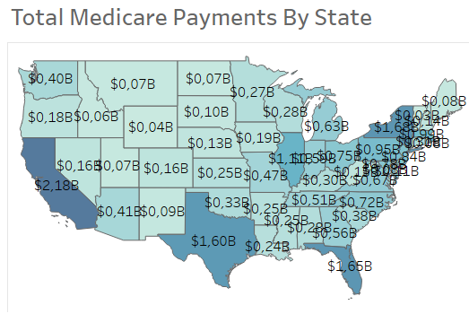
#### High Payment States:
- **California ($2.18B)**, **Florida ($1.65B)** and **New York ($1.68B)** have the largest Medicare payments, which correlates with their large senior populations and complex healthcare needs. 
- These states also have higher healthcare service utilization due to factors such as higher rates of chronic conditions, higher population density, and a higher proportion of Medicare beneficiaries. 
- For instance, California’s large metropolitan areas, like Los Angeles and San Francisco, have substantial healthcare infrastructure, contributing to these elevated payments.

#### Low Payment States:
- States such as **Wyoming ($0.04B)**, **Vermont ($0.03B)** and **North Dakota ($0.07B)** report much lower total Medicare payments. 
- These states generally have smaller populations and fewer healthcare facilities, which could contribute to lower overall spending. 
- Additionally, some of these states may have fewer elderly residents or more remote rural areas where Medicare-eligible individuals are either underrepresented or have limited access to care.

#### Regional Disparities:
- There is a notable regional disparity in Medicare payments, with states like **Texas ($1.60B), Pennsylvania ($0.95B) and Michigan ($0.63B)** receiving considerably more funding compared to smaller states such as **Alaska ($0.6B), Rhode Island ($0.08B) and Montana ($0.7B)**. 
- These variations reflect local healthcare needs and utilization patterns. In higher-payment states, particularly those with large urban centers, there is an increased demand for complex care services, which translates into higher Medicare expenditures. 
- Conversely, states with lower payments often have smaller populations with fewer healthcare services, resulting in a lower need for Medicare-funded care.

#### Impact of Urban vs. Rural Healthcare Needs:
- States with larger metropolitan areas like **New York, California and Florida**, which typically have larger hospitals, more healthcare providers, and higher incidences of complex diseases, tend to receive more Medicare funds. 
- In contrast, rural states such as **Wyoming and North Dakota** may see lower Medicare expenditures, which can also indicate challenges such as a lack of healthcare infrastructure, fewer specialized treatments, and limited access to healthcare professionals. 
- This urban-rural divide is crucial in understanding the total Medicare payments by state.

#### Payment Trends Across Major Conditions:
- For conditions like **CABG** (Coronary Artery Bypass Graft), **COPD** (Chronic Obstructive Pulmonary Disease) and **Heart Failure** (HF), high-payment states like **California, Florida and New York** tend to exhibit higher Medicare expenditures due to larger patient populations and more frequent hospitalizations. 
- These states also show higher treatment costs due to their advanced healthcare facilities and technologies. 
- States with lower Medicare expenditures for these conditions, such as **Hawaii or Vermont**, may have less complex care needs, lower patient volumes, or more efficient management of chronic conditions, leading to fewer hospital admissions.

### 4.2.3 Number of Facilities by State (Costs)
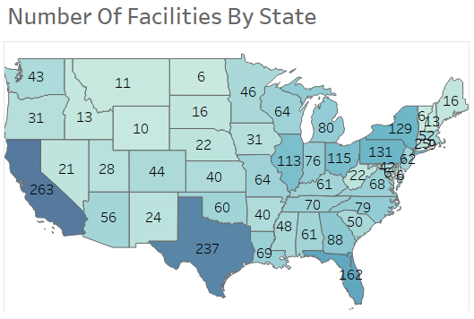
#### High Facility States:
- States such as **California (263), Texas (237) and Florida (162)** have the highest number of facilities. These states, with large and diverse populations, likely require a significant number of healthcare facilities to support the demand for services, including those related to complex care and specialized treatments. 
- The high number of facilities in these states suggests a robust healthcare infrastructure, which can lead to more competition and possibly higher operational costs due to the need for expansive networks, resource allocation and infrastructure upkeep.

#### Cost Implications in High Facility States:
- In high-facility states, like **California and Texas**, the sheer volume of healthcare institutions means that costs can be spread across a large network. 
- However, the cost per facility might be higher due to factors such as competition, administrative overhead, and the need to maintain multiple specialized centers. 
- This could result in increased healthcare costs for providers, insurers, and consumers, especially in urban areas where overhead expenses, labor, and technology adoption costs can add up significantly.

#### Low Facility States:
- States like **Alaska (8), Vermont (6) and North Dakota (6)** have a very small number of healthcare facilities. 
- These states face particular challenges in managing healthcare costs due to their low density of providers. 
- Having fewer facilities often translates into higher operational costs per facility, as these areas may struggle to leverage economies of scale. 
- Additionally, the fewer facilities in rural or remote areas could result in higher per-capita healthcare costs due to the need for specialized care, transportation costs and limited local infrastructure.

#### Regional Cost Disparities:
- There is a noticeable regional difference in facility density. States in the **Northeast** (e.g., New York (129), Massachusetts (52)) and **Midwest** (e.g., Illinois (113), Ohio (115)) tend to have moderate numbers of facilities, but still, the cost challenges in these states may stem from high patient volumes, dense populations in urban areas and increased administrative costs. 
- Conversely, rural states with fewer healthcare facilities may face high logistical costs, as patients have to travel longer distances, and providers often have to charge more for services to cover their fixed costs.

#### Cost Efficiency in Rural States:
- Rural states such as Montana (11), Wyoming (10), and South Dakota (16) may experience higher costs per facility due to the challenges of providing healthcare in remote locations. 
- Maintaining even a small number of facilities in these regions can be expensive, as these areas often face shortages of healthcare professionals, technological resources, and infrastructure. 
- These regions could greatly benefit from innovative cost-saving measures, such as telemedicine, mobile health units, and state-funded initiatives to improve rural healthcare access.

#### Impact of Aging Populations on Facility Costs:
- In states like **Florida (162)**, where the population includes a significant number of elderly individuals, the cost of healthcare services might be disproportionately higher due to the need for long-term care, specialized treatments and higher resource utilization for chronic conditions. 
- Similarly, other states with older populations may see increased facility numbers driven by demand for services like long-term care, memory care, and complex chronic disease management.

### 4.2.4. Average Medicare Payments by RUCA
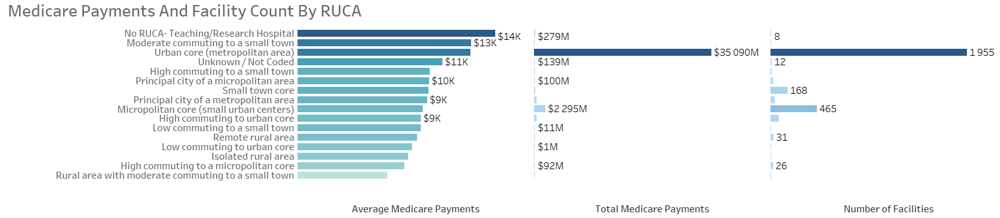
#### Higher Payments in Teaching/Research Hospitals:
- Across various conditions (e.g., CABG, Heart Attack (AMI) and Heart Failure (HF)), the No RUCA (Teaching/Research Hospital) category generally shows the highest Medicare payments. 
- For example, the CABG payment for Teaching Hospitals is $51k, which is significantly higher than in other regions, with small town core at $52k. 
- This suggests that teaching hospitals may offer more advanced or specialized care that leads to higher costs, possibly due to the involvement of medical students, residents, and higher-level medical procedures. 
- These hospitals are likely to have higher overheads, as they balance educational and patient care responsibilities.

#### Lower Payments in Remote and Isolated Areas:
- Payments in remote rural areas and isolated rural areas are typically the lowest across most conditions. 
- For instance, Heart Failure (HF) treatment in remote rural areas is $8k and COPD treatment in remote rural areas is $7k. 
- This can be attributed to fewer resources and lower facility costs in these regions. 
- Lower payments in these areas might reflect fewer specialized services available, as these regions typically rely on more general care with fewer advanced treatment options.

#### Geographical Variation in Payments:
- In urban core areas (metropolitan areas), such as New York or Los Angeles, the average Medicare payments are moderate to high for most conditions (e.g., Heart Attack (AMI) is $9k, Hip/Knee Replacement (THA/TKA) is $14k). 
- Urban centers benefit from a higher number of specialists and advanced treatment options, driving up payments compared to rural areas, where there are fewer specialized services. 
- This reflects both higher demand for healthcare services and the increased cost of living and doing business in urban environments.

#### Variation Across Procedures:
- The average Medicare payment for CABG (coronary artery bypass grafting) in small town core areas is significantly higher ($52k) compared to Heart Failure treatments ($9k across multiple locations). 
- This indicates that surgical procedures like CABG are more resource-intensive and expensive, which explains the higher cost in both rural and urban settings. 
- Conversely, conditions like COPD and Pneumonia have generally lower payments, with treatments varying across different RUCA areas from $7k to $11k, as these conditions may require less intensive care compared to major surgeries or acute conditions.

#### RUCA Patterns and Payment Levels:
- RUCA codes reveal that regions with higher commuting to urban or metropolitan centers (e.g., High commuting to urban core, High commuting to a micropolitan core) tend to have slightly lower payments for conditions like Heart Attack (AMI) ($8k-$10k). 
- This may indicate that proximity to urban healthcare infrastructure helps to reduce costs through increased competition, shared resources and more standardization of care practices.

#### Condition-Specific Cost Drivers:
- For specific conditions like CABG, Hip/Knee Replacement (THA/TKA), and Pneumonia, Medicare payments vary significantly by location. 
- For example, CABG in small town cores costs $52k, while in urban cores, the cost is $40k or less. 
- This indicates that the complexity of care required and the technology available in urban centers might reduce costs by allowing hospitals to perform surgeries more efficiently or with higher volumes, improving economies of scale. 
- Conversely, Pneumonia treatments in remote rural areas cost $8k, a low figure that may reflect the lack of advanced diagnostic tools and treatments available in these settings.

## 4.3. Facilities Dashboard

- This dashboard drills down to the facility level, analyzing the relationship between readmissions and both discharges and costs:

    - **Scatterplots**:

        - **Average Excess Readmission Ratio vs. Average Medicare Payments**

        - **Average Excess Readmission Ratio vs. Number of Discharges**: Each facility ID is plotted with color coding to represent one of four categories: High Outlier, Low Outlier, CMS Penalty or No Penalty. This allows stakeholders to visually isolate problematic facilities based on both statistical outlier status and CMS benchmarks.

    - **Matching Facilities Map**: A geographic map showing the count of facilities per state that are present in both datasets — useful for confirming completeness and data consistency when comparing costs and readmissions across the same provider pool.

### 4.3.1. Average Excess Readmission Ratio (ERR) by Average Medicare Payments for each Facility
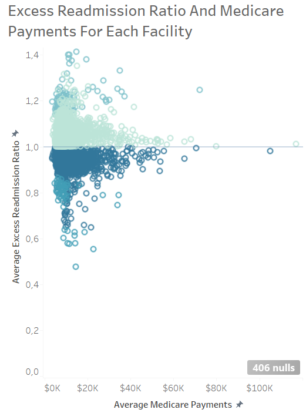
#### Weak Direct Correlation: 
- Across all conditions, there is generally a weak or non-existent direct correlation between the average Medicare payments per facility and the average excess readmission ratio. 
- This consistently suggests that the cost of care, as reflected by Medicare payments, is not the primary driver of hospital readmission rates. 
- Facilities with both lower and higher average payments can exhibit both higher and lower readmission ratios for various conditions.

#### Condition-Specific Patterns: 
- While a strong overall correlation is lacking, some condition-specific trends emerge. For COPD and potentially Heart Failure and Heart Attack, there's a subtle visual tendency for facilities with lower average Medicare payments to have a wider spread of readmission ratios, sometimes including a higher concentration of facilities with elevated readmission rates. 
- This warrants further investigation into potential resource limitations or care model differences in these settings.

#### Variable Performance Around the Benchmark: 
- The proportion of facilities performing above, at, or below the national benchmark (excess readmission ratio of 1.0) varies significantly by condition. Hip/Knee Replacement and Heart Attack tend to have a larger proportion of facilities at or below the benchmark, while COPD and Heart Failure show a greater number of facilities with higher-than-average readmission ratios.

#### Outliers Exist Across Payment Levels: 
- For all conditions, facilities with exceptionally high and low readmission ratios can be found across the spectrum of average Medicare payments. 
- This reinforces the idea that internal care processes and other factors beyond cost are critical determinants of readmission performance.

#### Data Completeness Varies: 
- The number of null values ranged from very low (CABG, Pneumonia) to moderate (Heart Attack, Hip/Knee Replacement), indicating varying levels of data completeness across conditions, which should be considered when interpreting the findings.

### 4.3.2. Average Excess Readmission Ratio (ERR) by Number of Discharges for each Facility
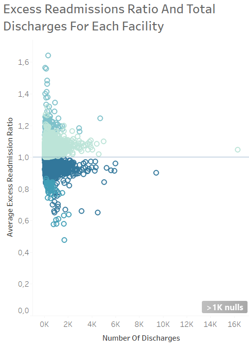
#### Weak Correlation Persists with Outlier Identification: 
- Even when differentiating facilities by outlier status and CMS penalty, the weak correlation between the number of discharges and the average excess readmission ratio remains consistent across all conditions. 
- This reinforces that volume alone doesn't dictate readmission performance, regardless of a facility's outlier status or penalty.

#### High Outliers More Prevalent at Lower Volumes (Some Conditions): 
- For some conditions (e.g., All, potentially CABG and Hip/Knee Replacement), the concentration of high outlier facilities (darkest blue) appears visually more pronounced at lower discharge volumes. 
- This suggests that smaller programs might be disproportionately represented among the worst performers for readmissions.

#### CMS Penalties Distributed Across Volumes: 
- Facilities incurring CMS penalties (second darkest blue) are observed across the spectrum of discharge volumes for most conditions, indicating that readmission issues leading to penalties are not limited to high or low-volume centers.

#### Low Outliers Show No Clear Volume Pattern: 
- Facilities with exceptionally low readmission ratios (lightest blue) do not exhibit a clear pattern related to discharge volume, suggesting that excellent readmission management can be achieved in both smaller and larger facilities.

#### Majority of Facilities Avoid Penalties and Outlier Status: 
- The largest group of facilities (light blue - no CMS penalty, not outliers) is distributed across all discharge volumes, highlighting that most facilities perform within an acceptable range relative to the national average.

### 4.3.3. Matching Facilities per State
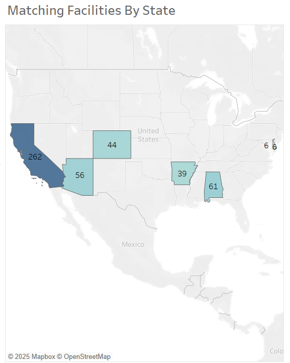
#### Varying Levels of Data Overlap 
- The number of matching facilities per state varies significantly. 
- For example, California (CA) has a high number of matching facilities (262), suggesting a strong overlap in data for that state. 
- In contrast, states like Alaska (AK) and the District of Columbia (DC) have very few matching facilities (8 and 6, respectively), indicating a limited overlap.

#### Potential for Biased Analysis
- States with a low number of matching facilities might be underrepresented in analyses that require merging or comparing data from both the readmissions and costs tables. 
- This could lead to a biased understanding of the relationship between these factors in those states.

#### Data Completeness Discrepancies
- The differences in matching facility counts could point to variations in data submission or reporting completeness between the two datasets across different states. 
- Some states might have more comprehensive reporting for both readmissions and costs.

## 5. Recommendations
## 5.1. Readmissions Dashboard
### 5.1.1. Facility Readmission List 
#### Hospital Executives (CEOs, CFOs, Administrators):
- **Focus on High-Risk Facilities**: Hospitals with high excess readmission ratios, especially those above 1.2, should be targeted for review. Facilities like Arizona Orthopedic And Surgery Speciality Hospital and Robert Wood Johnson University Hospital need to assess their discharge planning, post-care follow-up, and patient education to prevent avoidable readmissions.

- **Invest in Best Practices**: Study hospitals with excellent performance, such as Stanford Health Care and Sarasota Memorial Hospital, to identify successful care models, processes, and technologies that can be replicated across other facilities to reduce readmissions.

- **Resource Allocation**: Prioritize resources and interventions at facilities with high readmission ratios to reduce penalties and improve patient outcomes.

- **Audit High Outliers**: Oroville Hospital, St Lucie Medical Center, and others appearing frequently as poor performers should be priority candidates for quality audits, focusing on readmission drivers.

- **Recognize and Share Best Practices**: Facilities like Arkansas Surgical Hospital and Intermountain Medical Center can be benchmarked for post-discharge care models and patient follow-up processes.
#### CMS & Policy Makers:
- **Policy Adjustments**: Facilities with excess readmission ratios above the national average (1.2 and above) should be subject to targeted interventions and potential policy updates that focus on preventing unnecessary readmissions, particularly for complex conditions like CABG and COPD.

- **Incentives for Best Performing Facilities**: Increase incentives for hospitals that consistently perform well (below 0.8 in excess readmissions ratios) to encourage others to adopt similar practices and care models.

- **Support for Underperforming Hospitals**: Develop targeted improvement programs and funding for hospitals that are struggling with high readmission rates to help them meet national benchmarks and avoid CMS penalties.

#### Medical Officers & Quality Teams:
- **Intervention Programs**: Establish targeted intervention programs at facilities with high readmission ratios. These programs could include enhanced discharge planning, improved patient education on follow-up care, and more personalized care plans.

- **Focus on Specific Conditions**: For high-risk conditions such as Heart Failure (HF) and CABG, emphasize specialized care pathways to reduce readmissions. Review post-discharge monitoring and follow-up care protocols to identify gaps.

- **Continuous Monitoring**: Regularly track and monitor excess readmission ratios to identify emerging trends and adjust care strategies promptly.

- **Develop Condition-Specific Interventions**: Since excess readmission drivers vary by condition, deploy focused care bundles – e.g., for THA/TKA patients, prioritize rehab and mobility support; for COPD, focus on discharge meds and inhaler adherence.

- **Cross-train Staff in Readmission Best Practices** observed in top-performing facilities for transfer of knowledge across departments.

#### Health Insurance Companies:
- **Reimbursement Models**: Collaborate with hospitals to create reimbursement models that incentivize better post-discharge care and reduce avoidable readmissions. Adjust payment structures for facilities that consistently have high readmission rates, while rewarding those that manage to reduce these rates effectively.

- **Risk Adjustment**: Ensure that insurance plans account for higher risks in facilities with complex care needs, especially for conditions like COPD and CABG, to ensure fair compensation for the increased risk of readmissions.

- **Tie Policy to Multi-Condition Performance**: Consider incentive models that reward hospitals showing excellence across multiple conditions, not just one.

- **Highlight Geographic Trends**: Investigate how regional factors or facility types correlate with consistently high or low readmission rates.


#### Healthcare Data Analysts & Consultants:
- **In-depth Analysis**: Continue analyzing excess readmission ratios across different conditions to identify patterns and emerging risks. Dive deeper into individual facilities to assess the effectiveness of care models and discharge processes.

- **Actionable Insights**: Provide actionable insights to hospital administrators and medical teams based on the top-performing facilities to ensure continuous improvement.

### 5.1.2. Excess Readmission Ratio By RUCA
#### Hospital Executives (CEOs, CFOs, Administrators):
- **Focus on RUCA Areas with Higher Ratios**: Facilities in Principal city of a micropolitan area and Isolated rural areas, showing higher readmission ratios across multiple conditions, should be prioritized for intervention. Exploring ways to improve local care access, better manage post-discharge care, and reduce rehospitalizations will be key.

- **Leverage Data for Geographically Targeted Interventions**: Hospitals located in urban core and high commuting areas can benefit from understanding which specific regions have higher or lower readmission rates and tailoring interventions accordingly. For instance, targeted follow-up for heart failure or CABG patients in micropolitan areas might help lower excess readmission ratios.

#### CMS & Policy Makers:
- **Adjust Policy for Rural and Isolated Areas**: High readmission ratios in isolated rural areas and remote rural areas could be attributed to limited healthcare infrastructure and access to specialists. Supporting telemedicine, better transportation options for patients, and community health initiatives could reduce readmission rates in these areas.

- **Expand Support to Teaching/Research Hospitals**: Areas with No RUCA (teaching/research hospital) tend to show lower readmission ratios, suggesting that these facilities are better equipped to manage complex cases. Supporting other hospitals with similar capabilities might help improve performance across the board.

#### Medical Officers & Quality Teams:
- **Targeted Care Protocols**: Develop care protocols that specifically address the needs of patients in high commuting areas or small town cores, as these regions show elevated readmission rates for certain conditions. Tailored interventions for high-risk patients in these regions will be critical for reducing readmission rates.

- **Study Best Performing Areas**: Facilities in areas with high commuting to micropolitan core or rural areas that show lower readmission ratios should be studied for best practices, particularly around discharge planning and post-discharge care.

#### Healthcare Data Analysts & Consultants:
- **Geospatial Analysis for Tailored Interventions**: Continue exploring the data for additional geographical insights. Using this data, propose interventions that target hospitals or regions with specific needs based on their RUCA classification. Deep dive into the readmission patterns of rural vs urban locations to identify systemic issues that affect each group.

- **Continuous Monitoring by RUCA Type**: Regularly monitor excess readmission ratios for each RUCA type to track the effectiveness of interventions over time and adjust strategies as needed.

### 5.1.3. Number of Facilities by State
#### Hospital Executives (CEOs, CFOs, Administrators)
- **Benchmark Locally**: In states with a high number of facilities (e.g., TX, CA, FL), compare internal performance with local competitors to identify gaps and leading practices. There's more opportunity for shared learning and targeted collaboration.

- **Regional Collaboration**: In states with fewer facilities, consider forming partnerships or networks to pool resources, especially for patient follow-up, transitional care, and telemedicine implementation.

- **Infrastructure Planning**: Use facility distribution data to inform strategic decisions around service expansion, mergers, or focusing outreach in underserved areas.

#### Medicare & CMS Policy Makers
- **Policy Sensitivity by State Size**: Consider adjusting quality benchmarks or penalty structures for states with low facility density, where limited access may unfairly affect readmission performance.

- **Funding Equity**: Direct more funding or support toward rural and under-resourced states (e.g., ND, VT, WY) to reduce healthcare access disparities.

- **Regional Impact Modeling**: Use the facility counts as a foundation for evaluating the potential reach and ROI of national quality initiatives in each state.

#### Healthcare Data Analysts & Consultants
- **Targeted Comparative Analysis**: Prioritize regional comparison tools that highlight variation in performance across high-density states. This allows for precise, localized recommendations.

- **Data Normalization**: When evaluating readmissions across states, normalize data based on facility count to avoid skewed interpretations from larger states.

- **Support Rural Insights**: Highlight insights where low facility counts could mask systemic access issues and propose data-informed solutions for improving care in these areas.

### 5.1.4 Number of Discharges by State
####  Hospital Executives (CEOs, CFOs, Administrators)
- **Invest in regional capacity planning to align with discharge volumes**:
High-discharge states like Florida (194.3k), California (176.1k), and Texas (158.1k) signal significant service demand. Hospital leaders in these states should evaluate workforce, infrastructure, and service line expansion to manage volume efficiently and avoid bottlenecks.

- **Evaluate discharge pathways in low-volume states to ensure sustainability**:
States with low discharges such as Wyoming (3.5k), Vermont (4.8k), and Alaska (4.0k) may need innovative operational models (e.g., telehealth, mobile units) to maintain financial viability and quality care in low-density settings.

####  CMS & Policy Makers
- **Tailor national funding and policies to account for discharge volume variability**:
States like Florida (194.3k) and California (176.1k) have vastly higher hospital utilization than states like Wyoming (3.5k). Policies around Medicare reimbursements, hospital incentives, and rural subsidies should reflect this disparity to ensure equity and efficiency.

- **Target under-resourced states with policy interventions**:
Lower-discharge regions may also face healthcare access challenges. Policymakers should prioritize support programs and federal grants in these areas to ensure coverage and reduce outcome disparities.

#### Medical Officers & Quality Teams
- **Use discharge data to identify potential quality and readmission hotspots**:
States with high discharges such as New York (137.9k) and Illinois (117.2k) may experience care transitions that need tighter quality control. Implementing discharge audits and improving follow-up processes could mitigate avoidable readmissions.

- **Standardize discharge protocols across hospitals within high-volume states**:
Given the scale, inconsistent discharge practices can introduce risk. Quality teams should benchmark best practices within state systems to unify and streamline discharge-related care processes.

#### Health Insurance Companies
- **Refine care coordination and post-discharge services in high-volume states**:
States like Florida (194.3k) and Texas (158.1k) represent major risk pools. Payers should strengthen partnerships with hospitals for transitional care management and post-discharge follow-up to reduce unnecessary utilization and costs.

- **Design geographically tailored risk-adjusted payment models**:
Variation in state discharge volumes suggests differing utilization patterns. Insurers should use this data to calibrate premiums, bundled payments, and shared risk models by region for more accurate cost projections.

#### Healthcare Data Analysts & Consultants
- **Develop state-specific utilization benchmarks for hospitals and health systems**:
Comparing Alabama (35.4k) to Florida (194.3k) shows vast variation in inpatient throughput. Analysts should construct comparative models to help stakeholders assess performance against state and national trends.

- **Identify outliers and opportunities for system-level efficiency gains**:
Data-rich states like California (176.1k) and New York (137.9k) can serve as testbeds for advanced analytics, predicting patient flow and resource needs. Consultants should leverage this scale to pilot predictive discharge planning tools and system optimization models.

### 5.1.5. Average Excess Readmission Ratio (ERR) by State
#### Hospital Executives (CEOs, CFOs, Administrators):
- **Focus on states with high ERRs (1.02+)**: Target hospitals in these states for in-depth review, particularly Massachusetts, Florida, and District of Columbia. Investigate hospital readmission reduction strategies, including enhancing discharge planning and post-discharge follow-up care.
- **Implement data-driven interventions**: Use analytics to identify reasons behind readmissions and target clinical areas that contribute to higher ratios.

#### CMS & Policy Makers:
- **Provide targeted funding and support**: Increase funding or resources for states with higher ERRs to reduce readmission rates through improved care coordination, community health programs, and post-discharge services.
- **Establish state-specific benchmarks**: Use the ERR as a key metric to establish tailored state-specific improvement initiatives.

#### Medical Officers & Quality Teams:
- **Statewide quality improvement programs**: Launch quality initiatives specifically in higher ERR states, focusing on the reduction of unnecessary readmissions through improved clinical pathways, patient education, and post-discharge follow-up.

#### Health Insurance Companies:
- **Collaborate with high ERR states**: Work with hospitals in states like Massachusetts and Florida to implement value-based care programs that incentivize reducing readmissions.

- **Incentivize preventive care**: Offer financial incentives to hospitals and clinicians in states with higher readmissions to prioritize preventive care and follow-up procedures to reduce future readmissions.

#### Healthcare Data Analysts & Consultants:

- **Data-driven insights for targeted action**: Conduct detailed analysis to identify the most common causes of readmissions in higher ERR states and develop predictive models to identify at-risk patients before discharge.

## 5.2 Costs Dashboard
### 5.2.1. Average Medicare Payments By State
#### Hospital Executives (CEOs, CFOs, Administrators)
- **Optimize operational efficiencies in high-cost states**: States like California ($20.2k) and New York ($18.2k) show high Medicare payments. Hospital executives in these states should explore cost-reduction strategies through streamlined operations and technology to maintain quality care while controlling expenses.

- **Focus on service diversification in low-payment states**: In states like Alabama ($11.2k) and West Virginia ($11.8k), hospitals may consider expanding their service offerings to capture more Medicare patients and increase their reimbursement rates, ensuring their competitiveness in lower-cost regions.

- **Enhance care coordination and discharge planning**: Hospitals in both high and low payment states should focus on improving care coordination to prevent readmissions and reduce unnecessary stays, which will help maximize reimbursements and enhance patient outcomes.

#### CMS & Policy Makers
- **Adjust Medicare reimbursement rates based on regional disparities**: States like California and New York have high Medicare payments, while Alabama and West Virginia are on the lower end. Policymakers should consider adjusting Medicare reimbursement rates to reflect regional healthcare costs, ensuring fairer access to care for all beneficiaries.

- **Invest in underfunded regions**: Policymakers should prioritize funding for states like Alabama and West Virginia, where Medicare payments are lower. Targeted investment in these areas could improve healthcare access and attract more healthcare providers to underserved regions.

#### Medical Officers & Quality Teams
- **Improve care quality while controlling costs**: In states with high Medicare payments, like California and New York, medical officers and quality teams should focus on maintaining or improving care quality while exploring cost-saving initiatives, such as evidence-based practices and integrated care models.

- **Implement preventive care programs in low-cost regions**: In areas like Alabama and West Virginia, preventive care programs can help reduce the need for high-cost treatments, thus improving health outcomes while keeping Medicare expenditures low.

#### Health Insurance Companies
- **Refine care coordination and post-discharge services in high-volume states**: States like Florida ($12.8k) and Texas ($14.2k) represent major risk pools. Payers should strengthen partnerships with hospitals for transitional care management and post-discharge follow-up to reduce unnecessary utilization and costs.

- **Design geographically tailored risk-adjusted payment models**: Variation in state payment levels suggests differing utilization patterns. Insurers should use this data to calibrate premiums, bundled payments, and shared risk models by region for more accurate cost projections.

#### Healthcare Data Analysts & Consultants
- **Analyze regional cost drivers**: Healthcare data analysts should investigate regional factors that drive Medicare payment differences, such as provider density, patient demographics, and service utilization patterns. This will enable better forecasting and resource allocation.

- **Support predictive modeling for payment adjustments**: Data analysts can support CMS and policymakers by developing predictive models to forecast the impact of payment adjustments, helping to ensure fair reimbursement rates across diverse states.

### 5.2.2. Total Medicare Payments by State
#### Hospital Executives (CEOs, CFOs, Administrators)
- **Prioritize efficiency in high-payment regions**: 
    - States with higher Medicare payments, such as California and Florida, should focus on improving cost control and operational efficiency. 
    - Initiatives like reducing readmission rates, leveraging telemedicine for follow-up care and promoting value-based care can help manage high expenditures while ensuring quality care. 
    - Furthermore, developing partnerships with local community healthcare providers can reduce the need for costly inpatient services by enhancing preventative care and outpatient treatment.

- **Expand services in underfunded states**: 
    - Hospital leaders in low-payment states, such as Montana and Wyoming, should explore the expansion of services to better meet the needs of underserved populations. 
    - This can include extending outpatient services, improving access to primary care and increasing preventative health programs to reduce the long-term cost burden on the healthcare system. 
    - Additionally, investing in rural healthcare infrastructure, such as mobile health clinics or telehealth programs, can improve care delivery in areas with lower Medicare expenditures.

#### CMS & Policy Makers
- **Consider regional payment adjustments**: 
    - Policymakers should assess Medicare payment rates on a regional basis, considering the healthcare needs of each state. 
    - States like California and New York may require more funding to meet the demand for high-quality healthcare services, while rural states with fewer healthcare providers, like Wyoming and Vermont, may need adjusted payment models to reflect their specific healthcare delivery challenges. 
    - These adjustments could reduce disparities in healthcare access across states.

- **Increase support for lower-payment states**: 
    - States like North Dakota and Vermont, with lower Medicare payments, may benefit from additional funding to address the healthcare needs of their aging populations. 
    - This could include funding for rural healthcare infrastructure, increasing support for telemedicine and providing incentives for healthcare providers to practice in underserved areas. 
    - Such policies could help close the gap in healthcare access between high and low-payment states, ensuring more equitable care.

#### Medical Officers & Quality Teams
- **Improve care quality in high-payment regions**: 
    - In states with large Medicare expenditures like California and Florida, medical officers and quality teams should focus on improving care quality by implementing evidence-based care protocols, reducing readmission rates and optimizing care coordination. 
    - Developing patient-centered care models that focus on prevention and chronic disease management can help reduce long-term healthcare costs and improve patient outcomes in high-cost regions.

- **Promote preventative care in low-payment states**: 
    - In lower-expenditure states such as Vermont and North Dakota, healthcare teams should prioritize preventive care measures to reduce future healthcare utilization. 
    - This can include targeted interventions for chronic diseases, such as heart failure and COPD, and expanding access to screenings and immunizations. 
    - Establishing strong community health programs to engage populations in preventive health behaviors could reduce the future burden on Medicare.

#### Health Insurance Companies
- **Develop region-specific risk models for high-payment states**: 
    - Health insurers operating in high-payment states like California and Florida should develop region-specific risk models based on local healthcare utilization trends. 
    - By calibrating risk-adjusted payment models to account for higher service utilization and complex care needs, insurers can ensure more accurate premium pricing and better align their offerings with regional care needs. 
    - Additionally, they should consider providing incentives for hospitals and healthcare providers to adopt value-based care models that focus on improving outcomes while reducing costs.

- **Targeted care programs for underfunded regions**: 
    - Health insurers in states with lower Medicare payments should develop tailored care programs aimed at managing high-risk populations and preventing costly hospitalizations. 
    - These programs could include care coordination for chronic conditions, incentives for preventive services and support for rural health infrastructure. 
    - By focusing on regions with lower total Medicare expenditures, insurers can improve patient care while also reducing the need for expensive inpatient interventions.

#### Healthcare Data Analysts & Consultants
- **Investigate regional Medicare payment disparities**: 
    - Healthcare analysts should conduct in-depth studies to understand the factors driving the disparities in Medicare payments across states. 
    - Data on healthcare infrastructure, regional population health and access to medical care can provide insights into why some states, like California and Florida, receive significantly higher Medicare payments. - Analyzing these patterns can help guide policymakers in adjusting funding strategies to ensure more equitable distribution of resources.

- **Create predictive models for policy impact**: 
    - Data analysts should develop predictive models to assess the potential impacts of changes in Medicare payment policies on both high- and low-payment states. 
    - These models should consider factors like population health trends, healthcare access and provider capacity to predict how policy adjustments will affect Medicare expenditures and overall care outcomes. 
    - This approach can provide valuable insights for policymakers and stakeholders looking to optimize resource allocation across diverse regions.

### 5.2.3. Total Facilities by State (Costs)
#### Hospital Executives (CEOs, CFOs, Administrators)
- **Optimize operational efficiencies in high-density facility areas**:
    - Hospital executives in states with a high number of healthcare facilities, like California and Texas, should focus on improving operational efficiency to manage high overhead costs. 
    - This could involve consolidating services where possible, investing in health information technology to streamline operations and pursuing partnerships with other local healthcare providers to share resources. 
    - Additionally, focusing on reducing administrative waste and optimizing staff workflows could help control the rising costs associated with a dense network of facilities.

- **Invest in cost-saving initiatives in low-facility states***:
    - In states with fewer healthcare facilities, such as Alaska, North Dakota and Vermont, hospital executives should explore opportunities to reduce facility operational costs by leveraging digital health solutions such as telemedicine. 
    - By extending services remotely, these states can provide necessary care while reducing the operational burden of maintaining multiple physical facilities. 
    - Investment in mobile health units and remote patient monitoring technologies could also allow these facilities to reduce costs while maintaining a high standard of care for rural and underserved populations.

#### CMS & Policy Makers
- **Direct funding to cost-effective healthcare infrastructure in underserved regions**:
    - Policymakers should allocate resources to promote cost-effective healthcare infrastructure in low-facility states, where maintaining a large number of facilities might not be feasible. 
    - Supporting the integration of telemedicine and mobile health services could help mitigate high operational costs while improving access to care. 
    - Additionally, offering financial incentives to healthcare providers who expand services in rural areas could help improve healthcare access while keeping costs manageable for the state and its residents.

- **Support value-based care models in high-facility states**:
    - In high-facility states, the cost of healthcare is often compounded by inefficiencies in patient care delivery. 
    - Policymakers can push for the expansion of value-based care models, which reward healthcare providers for improving patient outcomes rather than simply increasing service volume. 
    - By reducing unnecessary procedures and optimizing care plans for chronic conditions, these models could reduce costs for both providers and patients, making healthcare more affordable and efficient in states with higher facility numbers.

#### Medical Officers & Quality Teams
- **Focus on cost-effective care strategies in high-demand states**:
    - Medical officers in states like California and Florida, where healthcare facilities are abundant, should develop strategies to ensure cost-effective care delivery. 
    - By utilizing care coordination programs, optimizing resource allocation and focusing on preventive care, medical teams can help reduce unnecessary hospital admissions and treatments, which can drive down overall healthcare costs. 
    - Additionally, implementing evidence-based care practices can contribute to better health outcomes and reduce wasteful spending.

- **Improve operational efficiency in low-facility regions**:
    - In states with fewer healthcare facilities, medical officers should focus on improving efficiency within each facility. 
    - This can be done by ensuring better resource utilization, such as utilizing telehealth solutions for follow-up care and mental health services. 
    - Streamlining the referral process for specialized care and reducing unnecessary transportation costs for patients could also lead to significant cost savings while improving access to necessary services.

#### Health Insurance Companies
- **Negotiate better rates in high-facility states**:
    - Health insurance companies operating in states with a high number of healthcare facilities, such as California and Texas, should focus on negotiating better reimbursement rates for services and creating narrow provider networks to reduce costs. 
    - By focusing on partnering with high-quality, cost-effective healthcare facilities, insurers can offer competitive premiums while ensuring that patients receive appropriate care without driving up healthcare spending.

- **Expand coverage for telemedicine in low-facility states**:
    - In low-facility states, health insurers should offer expanded coverage for telemedicine and remote health services. 
    - These services can help reduce the financial burden of maintaining numerous physical facilities by providing access to healthcare from home. 
    - By covering telehealth consultations, insurers can help control healthcare costs while increasing access for patients in underserved or rural regions.

#### Healthcare Data Analysts & Consultants
- **Evaluate cost distribution across high and low facility states**:
    - Data analysts should investigate the cost per facility in states with varying numbers of healthcare facilities. 
    - Comparing the cost structures in high-facility states with those in states with fewer facilities can provide valuable insights into the factors contributing to rising healthcare costs. 
    - Analysts can use this information to guide policymakers and hospital administrators on where to focus cost-saving initiatives, especially in areas where high administrative and operational costs are becoming a concern.

- **Model cost-saving strategies for rural healthcare**:
    - Healthcare consultants and analysts should build predictive models that assess the long-term cost implications of expanding telemedicine and mobile health services in rural states. 
    - These models should factor in variables such as travel distance, patient volume, and available healthcare resources to determine the most cost-effective methods for delivering care. 
    - Providing data-driven solutions to rural healthcare providers can help optimize their resources and lower healthcare costs in areas with fewer facilities.

### 5.2.4. Average Medicare Payments by RUCA
#### Hospital Executives (CEOs, CFOs, Administrators)
- **Optimize resource allocation in rural areas**:
    - In remote and isolated rural areas where Medicare payments are lower, hospital executives should focus on optimizing resource allocation to maintain care quality despite lower reimbursement rates. 
    - This might involve utilizing telemedicine to supplement in-person visits for specialized treatments or expanding the scope of services offered at lower-cost facilities. 
    - By leveraging technology and collaborating with nearby urban centers, rural facilities can reduce costs while still offering patients access to necessary care.

- **Leverage efficiencies in urban centers to reduce costs**:
    - In urban core areas where payments are moderate to high, hospitals should look for ways to reduce costs by streamlining processes, increasing patient throughput and optimizing hospital stay durations without compromising quality of care. 
    - Implementing data-driven management practices and using predictive analytics to manage patient flow could help in reducing overall treatment costs, even in high-volume urban settings.

#### CMS & Policy Makers
- **Encourage telehealth and mobile health services in rural areas**:
    - Policymakers should support initiatives that expand telehealth and mobile health services in low-payment areas, particularly in remote rural and isolated rural locations. 
    - Expanding the use of telehealth for follow-up visits, consultations, and chronic disease management could reduce the need for patients to travel long distances, thus lowering treatment costs while improving access to care. 
    - Additionally, policymakers could incentivize partnerships between urban hospitals and rural areas to share specialized services.

- **Promote value-based care models in urban settings**:
    - CMS could advocate for the adoption of value-based care models in urban areas where payments are higher. 
    - By focusing on outcome-based care rather than service volume, hospitals could achieve better results at a lower cost. 
    - The shift toward value-based care could also lead to more efficient use of resources, especially in high-complexity areas like CABG and Hip/Knee Replacement (THA/TKA) surgeries, where treatment costs are already high.

#### Medical Officers & Quality Teams
- **Focus on cost-efficient care in high-payment regions**:
    - Medical officers in urban areas should focus on strategies that promote cost-efficient care without compromising the quality of care, particularly in high-payment areas like CABG surgeries. 
    - Implementing evidence-based practices and reducing unnecessary tests or procedures could help control costs. 
    - Additionally, ensuring that care teams follow standardized treatment protocols for common conditions can streamline processes and reduce unnecessary expenditures.

- **Promote preventive care and chronic disease management in rural settings**:
    - In rural areas where Medicare payments are lower, medical officers should emphasize preventive care and chronic disease management to reduce the need for expensive acute care. 
    - Programs designed to manage chronic conditions like COPD and Heart Failure (HF) through regular monitoring, patient education and early intervention can reduce the need for costly hospitalizations and improve overall patient health.

#### Health Insurance Companies
- **Negotiate specialized payment models for rural healthcare**:
    - Health insurance companies should consider developing specialized payment models for rural healthcare providers, recognizing the challenges they face due to lower payment rates. 
    - These models could include higher reimbursement for rural hospitals, additional payments for telemedicine consultations or flexible payment structures for managing patients with complex needs who live in remote areas.

- **Support bundled payment models in urban areas**:
    - In urban areas with higher Medicare payments, insurers could encourage bundled payment models for high-cost procedures like Hip/Knee 
    Replacement and CABG. 
    - By bundling payments for all aspects of a procedure, insurers can provide hospitals with incentives to streamline care and focus on improving patient outcomes while reducing unnecessary costs.

#### Healthcare Data Analysts & Consultants
- **Analyze cost patterns to optimize resource allocation**:
    - Data analysts should focus on analyzing Medicare payment trends across different RUCA codes to identify opportunities for cost optimization. 
    - By comparing the average costs of different procedures and identifying areas with disproportionate spending (e.g., CABG in small towns vs. urban centers), analysts can recommend targeted interventions, such as more efficient care pathways, better resource allocation, or the adoption of technology to improve care delivery.

- **Support cost reduction strategies through predictive modeling**:
    - Healthcare consultants should utilize predictive models to forecast future Medicare payment trends based on current data. 
    - These models can help hospitals and insurers better understand how shifts in care delivery (e.g., the rise of telemedicine, changes in procedure complexity) might affect reimbursement rates. 
    - By identifying potential cost-saving opportunities, analysts can offer actionable insights to policymakers, hospital administrators and insurers.

## 5.3. Facilities Dashboard
### 5.3.1. Average Excess Readmission Ratio (ERR) by Average Medicare Payments for each Facility
#### Hospital Executives
- **Focus on tailored care pathways and support**: Prioritize the development and implementation of evidence-based clinical pathways and comprehensive post-discharge support systems that are specifically designed to address the unique needs of patients with different conditions.

- **Leverage internal performance insights**: Systematically analyze internal data to identify facilities within their network that consistently achieve low readmission rates for specific conditions, irrespective of reimbursement, and then implement strategies to disseminate and replicate their successful approaches across the organization.
- **Strategically address resource allocation**: Critically evaluate resource allocation in facilities with lower average Medicare payments that exhibit higher readmission rates, particularly for conditions like COPD and Heart Failure, and explore opportunities to optimize care delivery within existing financial constraints.

#### CMS & Policy Makers
- **Implement targeted quality improvement initiatives**: Continue to refine and strategically target quality improvement programs and incentives towards conditions with persistently high readmission rates, such as COPD and Heart Failure, and consider the specific challenges faced by lower-resourced facilities.

- **Evaluate and refine reimbursement strategies**: Conduct thorough evaluations of current reimbursement models to identify any unintended consequences that might contribute to higher readmission rates in certain settings or for specific conditions, and explore potential adjustments to better incentivize quality and outcomes.
- **Facilitate national learning and best practice sharing**: Establish and support national platforms or collaboratives to promote the sharing of evidence-based strategies and successful interventions for reducing readmissions across diverse healthcare providers and conditions.

#### Medical Officers & Quality Teams
- **Ensure consistent adherence to best practice guidelines**: Implement robust mechanisms to standardize and rigorously monitor adherence to evidence-based clinical practice guidelines known to reduce readmissions for each specific condition.

- **Enhance the patient journey through improved transitions**: Develop and implement comprehensive patient education programs tailored to each condition and critically evaluate and strengthen transition of care processes, including discharge planning, medication reconciliation, and timely follow-up.
- **Proactively manage high-risk patient populations**: Implement effective risk stratification tools to identify patients at elevated risk of readmission for specific conditions and develop targeted, proactive interventions and support strategies for these vulnerable individuals.

#### Health Insurance Companies
- **Incentivize value-driven healthcare delivery**: Design and implement reimbursement models that reward hospitals and providers for achieving superior outcomes, including low readmission rates, across a range of conditions, thereby shifting the focus from volume to value.

- **Support integrated and comprehensive care models**: Encourage and appropriately reimburse for healthcare delivery models that extend beyond the acute inpatient setting, such as robust outpatient management, home health services, telehealth interventions, and effective care coordination, particularly for chronic conditions associated with high readmission rates.
- **Promote efficiency and quality through bundled payments**: For suitable and predictable procedures, such as Hip/Knee Replacement, actively explore and implement bundled payment models that incentivize providers to manage the entire episode of care efficiently and effectively, including minimizing readmissions.

#### Healthcare Data Analysts & Consultants
- **Strengthen data infrastructure for comprehensive analysis**: Collaborate with healthcare organizations to improve data collection methodologies and integration processes to ensure more complete and accurate data for robust readmission analysis.

- **Employ advanced analytical techniques for deeper insights**: Utilize sophisticated statistical methods and machine learning techniques to identify key patient-level, hospital-level, and socioeconomic determinants of readmissions for various conditions, moving beyond basic correlations.
- **Develop predictive tools for proactive intervention**: Create predictive models that can accurately identify patients at high risk of readmission and translate these predictions into actionable insights that can be seamlessly integrated into clinical workflows to facilitate timely and targeted interventions.

### 5.3.2. Average Excess Readmission Ratio (ERR) by Number of Discharges for each Facility
#### Hospital Executives
- **Target interventions for high-outlier, low-volume programs**: 
    - Prioritize intensive quality improvement efforts and resource allocation towards lower-volume programs identified as high readmission outliers. 
    - Understand their specific challenges and implement tailored strategies to improve care pathways.
- **Analyze characteristics of penalized facilities across all volumes**:       
    - Conduct in-depth analyses of facilities incurring CMS penalties, regardless of their discharge volume, to identify common underlying causes of high readmissions and implement system-wide improvements.

- **Learn from low-outlier facilities**: 
    -  Study the care practices and protocols of facilities identified as low readmission outliers, across both low and high-volume centers, to identify and adopt best practices that can be scaled across the organization.

#### CMS & Policy Makers
- **Consider volume-based adjustments in penalty assessments**: 
Explore whether the current penalty system adequately accounts for potential challenges faced by lower-volume programs that might disproportionately appear as high outliers.

- **Target quality improvement resources towards high-outlier facilities**: Direct specific quality improvement resources, technical assistance, and best practice dissemination efforts towards facilities identified as high readmission outliers, particularly those with lower discharge volumes.

- **Monitor the distribution of penalized facilities**: Continuously analyze the characteristics and discharge volumes of penalized facilities to identify any systemic trends that need to be addressed through policy adjustments.

#### Medical Officers & Quality Teams
- **Implement focused interventions in high-outlier units**: Develop and implement targeted quality improvement initiatives within specific units or programs identified as high readmission outliers.

- **Share best practices from low-outlier facilities**: Facilitate the sharing of successful strategies and protocols from low readmission outlier facilities across all units and programs within the organization.

- **Monitor the impact of interventions on outlier status and penalties**: Track the effectiveness of quality improvement efforts in reducing the number of high outlier facilities and avoiding CMS penalties.

#### Health Insurance Companies
- **Focus value-based care on outlier reduction**: Design value-based care models that specifically incentivize the reduction of high readmission outliers and the avoidance of CMS penalties, regardless of facility volume.

- **Support targeted quality improvement programs**: Consider providing additional support or resources to facilities actively working to address their high outlier status.

- **Analyze cost implications of outliers and penalties**: Understand the financial impact of high readmission outliers and CMS penalties and use this information to inform reimbursement strategies that promote better outcomes.

#### Healthcare Data Analysts & Consultants
- **Conduct deeper dives into high and low outlier facilities**: Perform detailed analyses to identify the specific patient characteristics, care processes, and other factors that differentiate high and low readmission outlier facilities.

- **Model the relationship between volume and outlier status**: Explore statistical models to better understand if and how discharge volume might influence the likelihood of a facility being identified as a high or low readmission outlier.

- **Provide targeted insights to penalized facilities**: Offer specific, data-driven insights to facilities incurring CMS penalties to help them understand the root causes of their high readmissions and identify areas for improvement.

### 5.3.3. Matching Facilities by State
#### Hospital Executives (CEOs, CFOs, Administrators)
- **Understand Data Limitations for State-Specific Benchmarking**: When comparing your hospital's readmission and cost performance to state-level averages, be aware that the underlying data might have incomplete representation from all hospitals in your state, potentially skewing benchmarks.

- **Focus on Internal Data Integration**: Prioritize ensuring accurate and consistent internal data collection and linking of readmission and cost information at your facility level to gain a comprehensive understanding, regardless of state-level data limitations.

#### CMS & Policy Makers
- **Assess Data Completeness for State-Level Policy Decisions**: 
When formulating state-level policies or interventions based on readmission and cost data, acknowledge the potential for incomplete data from states with low matching facility counts.

- **Investigate Reasons for State-Level Data Discrepancies**: 
Explore why certain states have a lower overlap in readmission and cost data. Understanding the reasons (e.g., reporting differences, data system variations) can inform strategies for improved data collection.

#### Medical Officers & Quality Teams
- **Consider State-Level Data Gaps in Quality Improvement Initiatives**: When using state-level data to inform quality improvement initiatives, be mindful that the data might not fully represent the landscape of all hospitals within a given state.

- **Focus on Internal Facility-Level Data**: Emphasize the importance of robust internal data on readmissions and costs to drive quality improvement efforts within your hospital, supplementing potentially incomplete state-level views.

#### Health Insurance Companies
- **Interpret State-Level Cost and Readmission Trends with Caution**: When analyzing state-level trends in costs and readmissions to inform reimbursement policies or network strategies, acknowledge the potential for data gaps in states with low matching facility counts.

- **Focus on Contracted Provider Data**: Prioritize the analysis of cost and readmission data from the hospitals within your network where you have more complete and integrated information.

#### Healthcare Data Analysts & Consultants
- **Clearly Document Data Limitations in Reports**: When presenting analyses that use the merged readmissions and costs datasets, explicitly state the number of matching facilities per state and discuss the potential limitations this might impose on state-level comparisons or conclusions.

- **Explore Imputation Techniques (with caution)**: If appropriate and statistically sound, investigate potential imputation techniques to address missing data for states with low match rates, but clearly document the methods and assumptions used.

- **Recommend Improvements in Data Integration**: Advise stakeholders on strategies to improve the integration and matching of readmission and cost data at the state and national levels to enhance the robustness of future analyses.

## 6. Assumptions and Caveats
### 6.1. Assumptions
#### Date Alignment Across Tables
- The readmissions data spans a three-year period (July 2020 to June 2023). However, cost data is only available for 2022, and no date column exists in the costs table.

- **Assumption**: 2022 cost data is used as a proxy to represent financial patterns during the 2020–2023 readmissions period, under the belief that cost structures remain relatively stable year to year.


#### "Too Few to Report" Handling
- In the readmissions table, "Too Few to Report" values were replaced with zero for ```number_of_readmissions```.

- **Assumption**: These zeros imply low or negligible values rather than omitted high values, which helps retain facilities in analysis while avoiding artificial inflation.

#### Missing Values vs. No Service

- Fields like ```number_of_discharges```, ```expected_readmission_rate```, ```predicted_readmission_rate```, and ```excess_readmission_ratio``` had N/A values replaced with NULL.

- **Assumption**: NULLs indicate that the facility does not provide that specific service, not that the data was omitted due to reporting errors. This approach prevents inappropriate imputation or deletion.

#### Facility Name Consistency Across Tables

- **Assumption**: Facility names and IDs are entered consistently between the readmissions and costs datasets. Matching was done primarily via ```facility_id```.

#### Total Medicare Payments Calculation

```total_medicare_payments``` was calculated as:

```
average_medicare_payments * number_of_discharges
```
- **Assumption**: This method provides an accurate estimate of total Medicare outlay per state or RUCA category, assuming that average payments are fairly distributed across discharges.

#### Outlier Detection

- Outliers for readmission ratios and cost values were flagged using Z-scores and IQR, grouped by condition.

- **Assumption**: Outlier classification per condition provides a more context-sensitive view of abnormal performance than global thresholds.

### RUCA Code Substitution

- Facilities in the costs table with missing RUCA codes were assigned a value of "No RUCA – Teaching/Research Hospital".

- **Assumption**: These hospitals are primarily large academic centers, justifying this classification.

#### Join Method for Analysis

- A left join was used for most analyses, retaining unmatched rows from the readmissions table (e.g. CABG in Wyoming with no cost data).

- **Assumption**: Missing financial data does not warrant the exclusion of valuable readmissions data.

### 6.2. Caveats & Limitations
#### Date Misalignment Between Tables

Readmissions span three years while costs reflect only 2022. Any temporal mismatch may skew cost-to-readmission correlations.

#### Facility Mismatch

- Only 507 facilities are common between both datasets out of 5934 total (3085 in readmissions, 2849 in costs).

- This may limit the granularity and generalizability of visualizations involving both readmission and cost data, especially in scatterplots.

#### State-Level Aggregation May Mask Gaps

- Maps for state-level metrics include data even when facilities are not matched across datasets, which may create incomplete views for some states or conditions.

#### Nulls in Visualizations

- Nulls in Tableau (especially in scatterplots) arise due to unmatched facilities, missing condition-specific data, or incomplete RUCA classification.

- Increased nulls after applying color codes (e.g., for outlier classification) are due to condition-level filtering, where not all conditions are represented across all facilities.

#### Facility Counts Vary with Filtering

- Inconsistent facility counts across visualizations stem from filtering by condition or join type. For accurate representation:

- State-level facility counts come from the readmissions table.

- RUCA-based facility counts come from the costs table.

- Facility-level scatterplots only include the 507 matched facilities.

#### Data Source Coverage

- CMS data is comprehensive but may still under-report for smaller hospitals or hospitals in rural areas. Outliers and missing data may stem from real absence of services or limited data collection.

#### Assumption-Driven Cleaning Choices

- Retaining rows with NULLs (rather than imputing or deleting) maintains transparency but may underestimate or obscure insights where data is missing due to administrative gaps.

## 7. Code & Technical Implementation
### 7.1. Database Schema Setup and Data Insertion
The first part of the implementation involves creating the necessary tables and inserting data into them. This was accomplished using the following scripts:

#### 7.1.1 Creating ```ruca_codes_map``` Table
See the SQL code for: [ruca_codes_map](SQL_Code\7.ruca_map.sql)
- The ```ruca_codes_map``` table is designed to store the Rural-Urban Commuting Area (RUCA) codes and their corresponding descriptions. 
- RUCA codes categorize areas based on their urban-rural status and commuting patterns. 
- The table schema includes:

    - ```ruca_code``` (a ```VARCHAR``` field that serves as the primary key, storing the RUCA codes like '1.0', '2.2', etc.)

    - ```ruca_short_description``` (a ```TEXT``` field storing the descriptions of each RUCA code).

- Example entries inserted into the table include:

    - '1.0' -> 'Urban core (metropolitan area)'

    - '10.0' -> 'Remote rural area'

```sql
CREATE TABLE ruca_codes_map (
    ruca_code VARCHAR(5) PRIMARY KEY,
    ruca_short_description TEXT
);
```

The table was then populated with mappings of RUCA codes to their descriptions.

#### 7.1.2. Insertion of Data into ```ruca_codes_map```
See SQL code for: [ruca_codes_map](SQL_Code/7.ruca_map.sql)
- A series of ```INSERT INTO``` statements were used to populate the ```ruca_codes_map``` table with the necessary mappings of RUCA codes and their respective descriptions.

```sql
INSERT INTO ruca_codes_map (ruca_code, ruca_short_description) 
VALUES
    ('1.0', 'Urban core (metropolitan area)'),
    ('1.1', 'Principal city of a metropolitan area'),
    ('2.0', 'High commuting to urban core'),
    ('2.2', 'Moderate commuting to urban core'),
    ('3.0', 'Low commuting to urban core'),
    ('4.0', 'Micropolitan core (small urban centers)'),
    ('4.1', 'Principal city of a micropolitan area'),
    ('5.0', 'High commuting to a micropolitan core'),
    ('6.0', 'Low commuting to a micropolitan core'),
    ('7.0', 'Small town core'),
    ('7.1', 'High commuting to a small town'),
    ('7.2', 'Moderate commuting to a small town'),
    ('8.0', 'Low commuting to a small town'),
    ('9.0', 'Isolated rural area'),
    ('10.0', 'Remote rural area'),
    ('10.2', 'Rural area with moderate commuting to a small town'),
    ('99.0', 'Unknown / Not Coded');
```

### 7.2. Data Aggregation and State-Level Analysis
The second section of the implementation focuses on aggregating data from the ```readmissions_cleaned``` and ```costs_cleaned``` tables, which contain information about hospital readmissions and associated costs. The key operations here involve:

#### 7.2.1. Aggregating the Readmissions Data by State and Condition
- In this query, the goal is to calculate the total number of discharges, readmissions, and the average excess readmission ratio by state and condition. 
- This aggregation also counts the number of unique facilities involved.

- The following SQL constructs are used:

    - ```COUNT(DISTINCT facility_id)``` to get the number of unique facilities.

    - ```SUM(NULLIF(...))``` to sum up the values of discharges and readmissions, while handling potential null values.

    - ```AVG(NULLIF(...))``` to compute the average excess readmission ratio.

```sql
WITH readmissions_state AS (
    SELECT  
        state,
        condition,
        COUNT(DISTINCT facility_id) AS number_of_facilities,
        SUM(NULLIF(number_of_discharges, '') :: INT) AS total_discharges,
        SUM(NULLIF(number_of_readmissions, '') :: INT) AS total_readmissions,
        AVG (NULLIF(excess_readmission_ratio, '') :: DECIMAL) AS average_excess_readmissions_ratio
    FROM readmissions_cleaned
    GROUP BY state, condition
    ORDER BY state, condition
)
```

#### 7.2.2. Aggregating the Costs Data by State and Condition
- Similar aggregation is performed for the ```costs_cleaned``` table. 
- The goal here is to calculate the average total payments and Medicare payments for each state and condition.

```sql
, costs_state AS (
    SELECT  
        state,
        condition,
        AVG(NULLIF(average_total_payments, '') :: DECIMAL) AS average_total_payments,
        AVG(NULLIF(average_medicare_payments, '') :: DECIMAL) AS average_medicare_payments
    FROM costs_cleaned
    GROUP BY state, condition
    ORDER BY state, condition
)
```

#### 7.2.3. Merging Readmissions and Costs Data
The third query step involves merging the aggregated data from the ```readmissions_state``` and ```costs_state``` tables. A ```LEFT JOIN``` is used to ensure that every state-condition pair from the ```readmissions_state``` table appears in the result set, even if there is no matching record in the ```costs_state``` table.

```sql
SELECT  
    r.state,
    r.condition,
    r.number_of_facilities,
    r.total_discharges,
    r.total_readmissions,
    r.average_excess_readmissions_ratio,
    c.average_total_payments,
    c.average_medicare_payments
FROM readmissions_state r
LEFT JOIN costs_state c ON r.state = c.state AND r.condition = c.condition;
```

### 7.3. Facility Count and Matching Analysis
The next set of queries focuses on counting the total number of facilities per state and matching facility IDs between the two datasets (```readmissions_cleaned``` and ```costs_cleaned```):

#### 7.3.1. Facility Count per State
- This query computes the total number of unique facilities in the ```costs_cleaned``` table for each state and sorts the results in descending order.

```sql
SELECT  
    state,
    COUNT(DISTINCT facility_id) AS total_facilities
FROM costs_cleaned
GROUP BY state
ORDER BY COUNT(DISTINCT facility_id) DESC;
```

#### 7.3.2. Matching Facility Count between ```readmissions_cleaned``` and ```costs_cleaned```
- This query identifies the number of matching facilities between the two datasets, where the facility IDs appear in both the ```readmissions_cleaned``` and ```costs_cleaned``` tables. 
- The result is sorted by state in descending order of the facility count.

```sql
SELECT  
    c.state,
    COUNT(DISTINCT c.facility_id) AS number_of_facilities
FROM readmissions_cleaned r
INNER JOIN costs_cleaned c ON r.facility_id = c.facility_id
GROUP BY c.state
ORDER BY COUNT(DISTINCT c.facility_id) DESC;
```

### 7.4. Summary of Output and Data Flow
#### 7.4.1. Aggregated Data Output
- After executing the aggregation queries, the merged table (```rc_merged```) contains:

    - **State**: The U.S. state (e.g., 'CA', 'NY').

    - **Condition**: The specific medical condition (e.g., 'Heart Failure').

    - **Number of Facilities**: The count of facilities in each state for a given condition.

    - **Total Discharges**: The total number of discharges in each state-condition pair.

    - **Total Readmissions**: The total number of readmissions in each state-condition pair.

    - **Average Excess Readmissions Ratio**: The average excess readmission ratio for each state-condition pair.

    - **Average Total Payments**: The average total payments for the state-condition pair.

    - **Average Medicare Payments**: The average Medicare payments for the state-condition pair.

#### 7.4.2. CSV Exports
Separate CSV files were created for:

- ```rc_merged.csv```: The final merged dataset containing readmission and cost data aggregated by state and condition.

- ```costs_state_facility_count.csv```: A CSV file with the total number of facilities per state from the ```costs_cleaned``` table.

- ```matching_facility_totals.csv```: A CSV file containing the number of matching facilities between the ```readmissions_cleaned``` and ```costs_cleaned``` datasets.

<br>
This process ensures that data related to hospital readmissions and associated costs is aggregated and merged at the state and condition levels, providing meaningful insights into healthcare trends and resource allocation across states and conditions.

### 7.5. Tableau Dashboard Implementation
- To effectively visualize and interpret the data, multiple Tableau dashboards were developed using four integrated data sources. 
- These dashboards support interactive analysis by condition, geography, facility, and urban-rural context.

#### 7.5.1. Data Sources Used in Tableau

| Data Source Name	| Description |
|-------------------|-------------|
|**Medicare: State + Condition** |	Based on the ```rc_merged table```; aggregated state-level data on costs and readmissions.
|**Medicare: Facility + Condition** |	Joined ```readmissions_cleaned``` and ```costs_cleaned``` tables on ```facility_id``` and ```condition``` with a one-to-many relationship.
|**matching_facility_totals** |	Contains matched facilities between the two datasets for comparison.
|**costs_state_facility_count** |	Aggregated facility counts by state from the ```costs_cleaned``` table.

#### 7.5.2. Global Filtering Mechanism
- To enable consistent cross-dataset filtering, a **Global Condition Parameter** was created:

    - **Type**: String parameter

    - **Values**: List of all six conditions (Heart Attack, Heart Failure, Pneumonia, COPD, CABG, THA/TKA) plus ```'All'```
    - **Purpose**: Filters all graphs across dashboards regardless of their data source.

Calculated fields were created in each data source to apply this parameter as a filter:

- In ```Medicare: State + Condition```:

```tableau
// p state condition
[Global Condition Parameter] = [Condition] OR [Global Condition Parameter] = 'All'
```

- In ```Medicare: Facility + Condition```:

```tableau
// p facility condition
[Global Condition Parameter] = [Condition] OR [Global Condition Parameter] = 'All'
```

#### 7.5.3. Key Tableau Calculated Fields
**A. Readmission & Outlier Logic**

- **Color Code Above/Below 1** <br>
Categorizes facilities based on CMS penalty threshold and outlier status:

```tableau
IF [Excess Readmission Ratio] > 1 AND [Excess Outlier Status] = 'High Outlier' THEN 'High Outlier'
ELSEIF [Excess Readmission Ratio] <= 1 AND [Excess Outlier Status] = 'Low Outlier' THEN 'Low Outlier'
ELSEIF [Excess Readmission Ratio] > 1 THEN 'CMS Penalty'
ELSEIF [Excess Readmission Ratio] <= 1 THEN 'No CMS Penalty'
END
```

- **Index** <br>
Used for sorting or ranking facility rows:

```tableau
INDEX()
```

**B. Cost Calculations**

- **Total Medicare Payments** <br> Computes weighted cost per state-condition pair:

```tableau
SUM([Average Medicare Payments] * [Total Discharges])
```

- **Unique Total Facility Count** <br>
Adjusts inflated facility count due to repeated joins per condition:

```tableau
{FIXED [State]: (SUM([Number Of Facilities])/6)}
```

#### 7.5.4. Dashboard Filters and Interactions
Each dashboard is designed to support rich interaction through filters:

- **Global Filters**:

    - ```Global Condition Parameter``` (applies across all dashboards)

    - Facility Name search bar

    - Sliders for:

        - ```Average Excess Readmission Ratio```

        - ```Average Medicare Payments```

        - ```Total Medicare Payments```

    - Color Code Dropdown: distinguishes ```CMS Penalty```, ```No CMS Penalty```, ```High Outlier```, ```Low Outlier```

#### 7.5.5. Scatterplot Visual Enhancements
Both scatterplots (Readmissions vs. Discharges and Readmissions vs. Medicare Payments) use:

- **Color Encoding** via ```Color Code Above/Below 1``` to distinguish key performance categories.

- **Reference Lines**:

    - **Constant Line** at **Excess Readmission Ratio = 1.0** to represent the CMS penalty threshold.

This Tableau setup allows users to interactively drill down by condition, identify high-cost or high-readmission facilities, and assess how geography and urbanization impact healthcare outcomes and costs. The calculated fields, filters, and color codes all work together to enable informed decision-making for diverse healthcare stakeholders.

